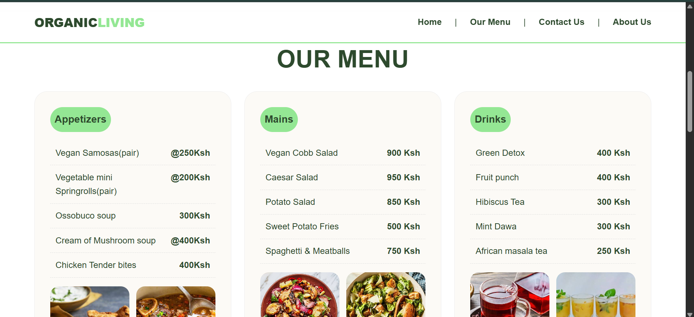
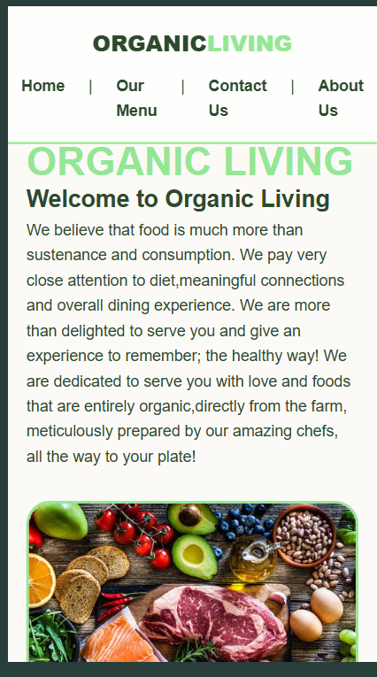

# Organic Living Restaurant
> A responsive farm-to-table restaurant landing page that promotes healthy and organic dining,where the products are sourced directly from local farmers.
## Project Brief
Organic living is a single-page landing website for a fictional organic restaurant in Nairobi. It focuses on nutrition and very attentive to what consumers eat. Organic living is dedicated to not only satisfy hunger, but to also add necessary nutrients to the body for longevity. This project was built as a class assignment,using HTML and CSS.

The website is structured into 4 main sections, that are linked from the navbar:
1. **Home:** Brand introduction which has the Organic Living logo with a welcome message and hero images 'organic_foods.jpg' and 'organic_plate.jpg'
2. **Our Menu:** This section is divided into 3 sections, namely: Appetizers, Mains and Drinks. The food items are priced in Kenyan shillings and there are a few images of the foods served as well. Each category iswrapped in 'div class=menu-card' to enable the use of the grid layout.
3. **About Us:** Explains the business having 5 branches acrossthe city, free delivery within the city and a cost of 100Ksh of deliveries outside the city. The opening hours are highlighted here.
4. **Contact Us:** Here you will find a form with personal information like: name, email, phone number, and a message box, all needed to be filled in.

## Business Rationale / Features
**Problem Solved:** Many people want healthy eating but don't know where to get truly organic food. This site builds trust by showing the farm-to-plate story, transparent pricing, and delivery information.

**Key Features:**
- Sticky navbar with `position: sticky` for easy navigation
- Hero section with clear value proposition and high-quality images with `object-fit: cover` and rounded borders in main color `rgb(148,231,148)`
- Menu cards with `border-radius`, `flex-direction: column`, and dashed separators for price list readability
- Opening hours styled as pills for better visuals.
- Accessible form with `required` attributes and semantic `<fieldset>` and `<legend>`
- Fully responsive from 320px phones to 4K desktops - no horizontal scroll
- Color Psychology: Main green `rgb(148,231,148)` = freshness, health, nature; Dark green `#2d4a2d` = trust, earth; Cream `#fcfaf6` = organic paper / clean plate
- Pure HTML & CSS only.

## Technologies Used
- HTML - Semantic tags: 'nav', 'section', 'footer', 'form', 'fieldset', etc.
- CSS - Grid, Flexbox, Media Queries, CSS variables, Clamp()

### How to run locally on your computer
1. **Clone the repo** - 
   '''bash
   git clone https://github.com/David-Mwonge123/organic_living.git
2. **Go into the project folder**
   cd organic_living
3. Open in VS Code
   code .
4. **Open with Live Server**
   -Install Live Server extension in VS Code
   -Right-click index.html>Open with live server
   -Or just double-click index.html in file explorer

### How to Deploy to Github pages
**First time Setup**
1. Create repo on github named 'organic_living'
2. In your project folder terminal:
   git init
   git add .
   git commit -m "Initial commit - Organic Living Restaurant
   git branch -M main
   git remote add origin https://github.com/David-Mwonge123/organic_living.git
   git push -u origin main
3. Go to github.com > your repo > settings > pages
4. Under build and deployment:
   -Source: Deploy from a branch
   -Branch: Main/root
   -Click Save
5. Wait 1-2 minutes ,refresh, and your link will appear on the top of your page.
**To Update Changes:**
   -git add .
   -git commit -m "Add changes"
   -git push origin main

### Desktop Responsive

### Mobile Responsive

### Author
David Mwonge
Student-Zindua School-Software Engineering